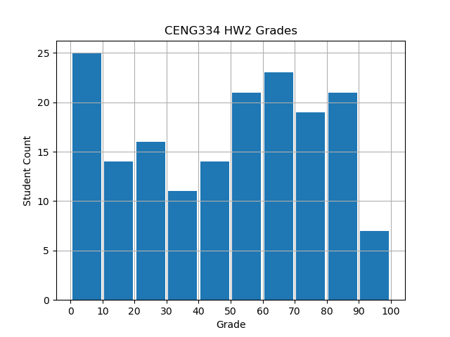

#### What is life without a histogram?



# Grading Guide 

I tried to not make grading harsh in general:
* Easier test cases have more points than the harder test cases.
* Many things only cause penalties instead of full on test case failure.
* Timeout/deadlock and logic errors in general will still fail the test case.

# IMPORTANT!

While repetition increases the reliability of testing, there is invariably
some variance involved with your grade due to the non-determinism. If you can increase your 
grade by more than 5 by just re-running the grading (on the listed ineks), please notify me.

## How to use the grader?

```
> cd grader
> ./grade io/ <dir-containing-extracted-submission> my-output
```

`<dir-containing-extracted-submission>` should be the directory containing your
extracted submission. The script will `cd` into it and attempt to `make all`. 
Once the script is done, you can see all the output files in the `my-output`
directory.

Also, make sure that the `python` command runs at least Python 3.8+ if testing
locally. It works by default on the ineks.

Do note that the consistency checker can take up to a minute (on the ineks) on larger inputs. 
You can blame the author for being too lazy to implement Quadtrees/R-trees to speed it up!

## How does grading work?

### Test Case Structure

Cases are contained under `io/inputs`. There is a directory for each part, with each containing
the cases for that specific part. Each test case itself is a folder like `0_simplest`, and 
contains two files:
* `input.txt`: The actual input passed to your `hw2` executable.
* `opts.txt`: Properties of the test case. 
    * Line 1: How many points the test case is out of 100.
    * Line 2: How many times to run the test case. Chosen based on a variety of factors. You get
       the minimum grade of all the runs. e.g. if any run gets zero, the test case gets zero.
    * Line 3: How many seconds to allow before timing out your program. 
    * Line 4: Arguments to pass to `check_consistency.py`, which is used for checking the
        consistency of the outputs. May be empty for some cases.

### Environment

Grading has been performed on the ineks having the fastest CPUs. These are the following: inek65, inek68, inek71, inek73, inek76, inek78, inek79, inek80, inek81, inek82, inek84, inek85, inek86, inek87, inek88, inek89, inek90, inek91, inek92, inek93, inek94, inek96, inek97, inek98, inek99.

You can use any one of these to try out the grading script yourself.

### Compilation

The `hw2` executable is removed from your directory in case you submitted one. 
Then, `make all` is attempted with two different versions of `hw2_output.h` and `hw2_output.c`:
The original one containing `GATHERER_*` in the action enumeration, and the new one containing
`PROPER_PRIVATE_*`. If either of them work, we're good to go!

### Execution

Really straightforward. Your program is run with the timeout value of the test case and given
the input. If it times out, a deadlock is assumed since the timeout is generous and 
the test case fails. 

The output is stored in a file, and `check_consistency.py` is run on your output, keeping the
input in consideration. It checks a whole bunch of things! If it fails, so does the test case.
Some things do not fail but are penalized, which is reflected as a multiplier on the test
case grade. 

This whole process of running and checking is repeated multiple times, and you get the
minimum grade from all the runs. Why? Because problems don't always happen in multi-threaded
programs, but if they do, that's a sure sign of a mistake in your code.  

### Result Directory Structure

Your result directory contains:
* `grader_log.txt`: A summary of your homework's grading. First thing you should look at!
    You can then delve into the subdirectories if you want to, depending on what you see
    on the log.
* `make_log_*.txt`: Logs from `make all`, `_p` when using the new `hw2_output.*` files, and
    `_g` when using the old.
* `grade.txt`: Contains your raw total grade as detailed in the grader log. Subdirectories
    also contain this file, implying part/test case grades. 
* `outputs`: A folder containing your outputs, structure similar to the inputs.
    * `part?`: One subdirectory for each part, containing the test cases.
        * `?_case_name`: One subdirectory for each test case. Containing:
            * `run?`: One subdirectory for each run. And finally, each run contains:
                * `output.txt`: Your code's stdout for this run. 
                * `error.txt`: Your code's stderr for this run.
                * `consistency_check.txt`: Output of `check_consistency.py` for this run.
                    Only contains warnings and errors for the larger test cases.

### Dealing with Large Outputs

There are some large test cases, and since they are run multiple times the results directory
can grow quite large. To deal with this, the grader has two precautions for large test cases:
* Output files larger than 256KB are compressed with `xz`, which reduces their size by a factor
    of 10-15. Their extension will be `.txt.xz` in that case. You can decompress them with
    `unxz` or view them with `xzcat`/`vim`.
* The consistency checker only outputs warnings and errors, and no OK messages. You can re-run
    the checker with the input, your output and the test case's options if you want to see
    the whole output. The checker is deterministic unlike our `hw2` programs!

## Pointers and Details

### Common Mistakes

1. Wrong timings between gatherings/flickings. One culprit is trying to use `sleep(unsigned)` 
    with floating point values which casts the value to an unsigned integer and wrecks your
    dreams. Another is using microseconds instead of milliseconds. 
1. Refusing to check for EOF. Once again, all of part1/2/3 inputs are valid as stated in the
    homework PDF. 0 is not explicitly
    provided for the number of orders in part1 and for the number of sneaky smokers in part 2.
    Your code <ins>needs to check for EOF</ins>. 
1. Leaving garbage in stdout. Just don't.
1. Arriving at an area every time a cigbutt is gathered. Notifications are supposed to go like
    *arrived-gathered-gathered-gathered-gathered*... Not like
    *arrived-gathered-arrived-gathered-arrived-gathered*...
1. Inconsistent notifications. The only way the consistency checker can know what's going on
    in your program is through notifications. For example, let's say you send out an order in 
    your program and a soldier reacts to it with a notification such as "took a break". But 
    you haven't send the order notification "BREAK!" yet for some reason. Then, it will seem 
    like your soldier reacted to an order that was not given, and that will be an inconsistency.

### Penalized Events

The consistency checker penalizes the following mostly time-related events, and does not fail 
the test case when they happen. A percentage penalty is applied to the test case:
1. Too much waiting between two gatherings: 15%.
1. Too little waiting between two gatherings: 35%. This is pretty much a logic error.
1. Delaying sending orders too much: 20%.
1. Soldier reacting to an order too late: 10%.
1. Soldier sending other notifications after receiving an order, instead of immediately reacting to the order: 20%. 
1. Reacting to pointless orders like BREAK! while on a break, CONTINUE! while working: 10%.
1. Sending the next order before everyone has reacted, causing confusion. This can still result
    in a fatal logic error down the line: 15%.
1. A proper private/sneaky smoker seems to be waiting on an area when it should not be because it is not blocked. Remember this from `complex_scenarios.pdf`, this is for Part 3 only: 50%.
1. Too much waiting betweeen two flickings: 20%.
1. Too little waiting between two flickings: 40%. A bit harsher than gatherings since this is Part 3.

All these have tolerance parameters that change depending on the test case and
are mostly pretty generous.

### Failure Events

Events that cause you to fail the test case are kind of too many to count here,
but they're usually straightforward errors that come from not sticking to
homework specifics:

* Arriving at an area that is locked by someone else. 
* Arriving at an area before clearing a previous area.
* No creation notification.
* Not everyone has exited when the program terminated.
* Thread ID for a proper private or sneaky smoker changing during the run. 
    Creation/exit notifications being sent by
    another thread is fine, even though I did not want that either :P
* Clearing an area when there are more than 0 cigbutts left.
* Not all orders were sent when the program terminated.
* Sending wrong orders.
* Reacting when there are no orders.

etc. etc. You can probably guess how this goes! If you really want to know, just
delve into `check_consistency.py`. It's not exactly well architected though,
unlike my homework solution.

## Test Case Details

### Part 1

* **0_simplest (5):** One cell, one proper private. Doesn't get easier!
* **1_one_private_six_areas (4):** Self-explanatory. One private gathering from 6
      areas in sequence.
* **2_indeps (4):** A bunch of privates gathering from non-intersecting areas.
* **3_simple_intersect (4):** Two privates intersecting. First real synchronization.
* **4_five_on_one (3):** Five privates trying to gather from one cell. A bit more
    fun with the synchronization.
* **5_some_action (3):** A bunch of privates, a bunch of areas. See how it goes.
* **6_chaos (2):** A large input. Things get problematic!

### Part 2

* **0_simple_break_cont (5):** One cell, one private, one break, one continue.
    Huzur <3
* **1_stop (5):** A few privates, a stop order arrives after some time.
* **2_breaks_and_conts (5):** 10 privates, taking a break and continuing thrice.
    Nice.
* **3_break_cont_stop (4):** A few privates taking a break, continuing, and then
    stopping. Just making sure you didn't mess up the sync there!
* **4_break_stop (4):** A stop during a break. Hope you can still stop!
* **5_redundant (3):** A bunch of redundant orders are given, like CONTINUE!
    while working and BREAK! during breaks. Have to deliver the orders, but privates 
    should not react.
* **6_orders_after_stop (3):** Orders continue after a stop order. Have to
      deliver them all before exiting the program.
* **7_lightning_break_cont (2):** Break and continue with only 1 ms in between.
      A little test for fast consecutive orders.
* **8_big_mostly_indep (2):** Large input with mostly small, non-intersecting
    areas.
* **9_many_dep (2):** Similar, but with larger areas that should intersect more
    often.

### Part 3

The checker starts checking for unnecessary blocking here. If you do, it's still not
the end! You get half points.

* **0_cc_three_pp_case (8):** The legendary (!) case from
    `complex_scenarios.pdf`. Orders and smokers are provided as 0 explicitly since
    this is a part 3 input.
* **1_flick_count_check (4):** Simple scenario with one private and one smoker,
    making sure the flicks apply to the grid correctly.
* **2_same_cell_smokers (4):** A bunch of smokers trying to share a cell, should
    block each other.
* **3_smokers_grouped (4):** A bunch of smokers clustered tightly. Should not be
    a synchronization problem.
* **4_one_pp_one_ss (4):** A private and a smoker intersecting.
* **5_more_pp_and_ss (4):** Same idea, but with more privates and smokers.
* **6_smoker_stop (4):** A stop order for input containing smokers. They have to
      stop too!
* **7_medium_pp_ss_order (3):** A medium sized input with privates, smokers,
      breaks and everything.
* **8_hell_on_grid (2):** A large input with many cells, smokers, sneakers and
      some orders. Very problematic, if I should say so myself, it's a real deadlock-magnet.
* **9_another_hell_on_grid (2):** Same, but with slightly larger areas. 
* **A_blazing_cigbutts (1):** Four sneaky smokers littering with 0 time wait, and then
      their cigbutts are gathered by a proper private. Checking for cell consistency.

## Verdict

I hope I did not induce too much pain with this homework! It certainly is was
not a trivial thing to implement, even though it may seem so to untrained eyes.
Just a grid and some people, right? 

Anyway, getting it right was not the absolute aim! If during the homework you
thought a lot about synchronization, realized how hard it is, discovered and
applied different approaches and considered their strengths and weaknesses, that
is more than enough! My main goal was putting you as far away as possible from
the sentence "I have no idea about synchronization!" in one homework.

**I'll share my solution and a sketch of the solution's general idea after the
objections.**

I'm personally proud of all the work I've seen in all the submissions, if you'll
allow me that. I think you
should be too! Kinda sad that I won't be able to give you all more homeworks ;)
Hope you enjoy your senior year/graduation.

All the best!

Deniz

